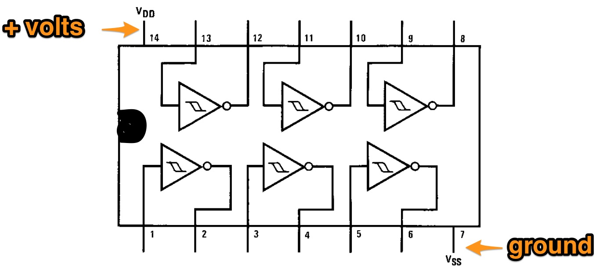
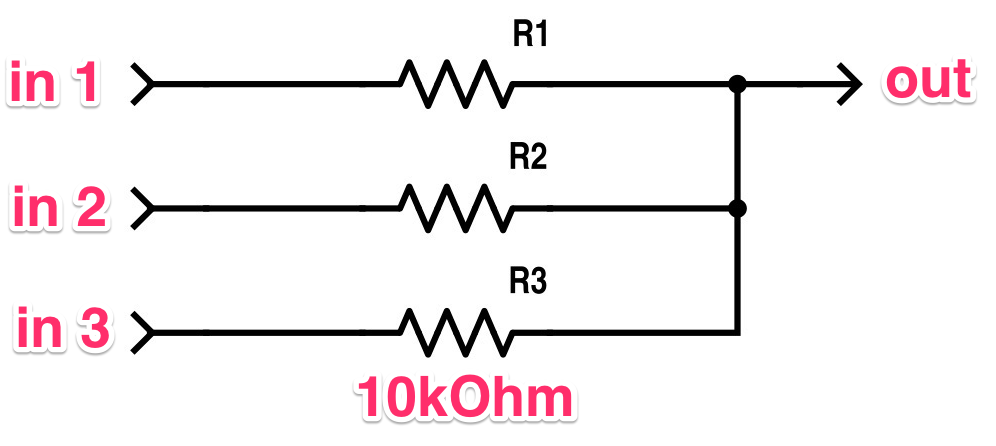
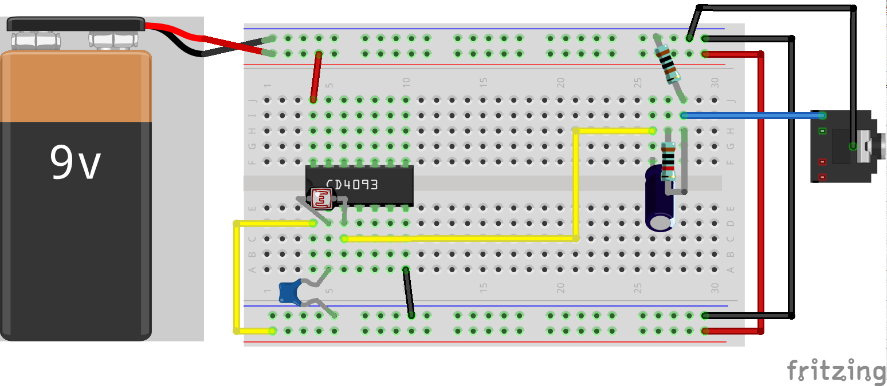

---
title: DIY Synthesiser Workshop 
author: Charles Martin
...

This workshop is a crash-course in creating sound-making electronics!
We're going to use some inexpensive parts to make some insane, noisy
synthesisers and think about some ways to use them in performances.

The key parts we're using are two integrated circuits (ICs) which are
(big versions of) some of the building blocks of computers. In digital
electronics, signals are either on ("high" or connected to positive
voltage) or off ("low" or connected to ground or 0 volts). One IC
contains inverters or NOT-gates that output the opposite of their
input (so high becomes low). The other contains NAND-gates which have
two inputs and are only high if both inputs are low. Both of these
elements can be easily used to make circuits that oscillate (go from
high to low and back) at audio frequencies. Connect the oscillating
signal to a speaker and BAM you've got a synthesiser.

The cool part is that with one chip we can make not one but SIX
inverter synth voices and the other can make four voices of NAND
oscillators. By mixing the voices together or using them to control
each other we can make some very interesting sonic results.

Each kit contains a project box, battery and some parts. We'll do a
few experiments together to figure out the possibilities of these
parts but at the end of the workshop, you'll have a hackable
synthesiser built into the project box ready for your next
experimental music session.

## Schedule

- 10am: General Electronics, Making a Sound
    - Making circuits on a breadboard
    - A one oscillator synth
    - Making a volume control
    - Controlling Pitch
- 11:15am: Coffee!
- 11:30am: Making a CD40106 Synthesiser
    - Controlling Pitch with light sensors
    - Mixing signals
- 1pm: Lunch!
- 2pm: Oscillators that Control Oscillators
    - Sound with the CD4093
    - Making rhythms with a Low Frequency Oscillator
- 3pm: Make a personalised instrument
    - Combine parts from the day to make a personal instrument
    - Make a custom prototype enclosure from cardboard and plastic
      containers.
- 4:30pm: Mini-Concert
    - Play a solo or ensemble piece with your new instrument.

## Parts in your DIY Synth Kit

- breadboard
- 9V battery
- 9V battery lead
- strip of header pins
- alligator clips
- jumper leads
- 40106 - hex inverter IC (one little chip)
- CD4093 - quad nand gate IC (other little chip)
- Potentiometers: 10KOhm, 100KOhm, 1MOhm (knobs)
- Light Dependent Resistors (LDR)

### Other Parts available to take

- bunch of resistors (esp. 1K, 10K, 100K)
- bunch of diodes
- extra LDRs 
- extra potentiometers
- breadboard wire (thin solid core wire for making breadboard
  connections)

### Tools available

- soldering irons
- pliers
- wire cutters
- mini speakers

## Parts we need

### Battery

We're all familiar with batteries - they store electrical power and
when you connect the + terminal to the - terminal electrical current
will flow between the two terminals until the power in the battery is
consumed. 9V batteries are convenient because they're small and have a
lot of volts (useful for powering complicated circuits) - but they
don't have a high capacity so they can't supply a high current for a
long time.

(In contrast, AA batteries have much higher capacities, but can only
supply 1.5V each, so devices typically use more than one.)

### Resistors

Resistors slow down the flow of electrical current. If you connect
the + and - terminals of a 9V battery you might find that the wire
will quickly get too hot to touch - too much current is flowing, which
causes the metal to heat up, and the battery to run down quickly.

Resistors are used for slowing down electrical current in circuits.
Some reasons to do this are: so that other components aren't damaged
by excessive current, so we don't run down batteries too quickly!

Two resistors can also form a simple circuit called a voltage divider
that converts from a high to lower voltage. And we can also use
resistors to create a simple mixer! They're all around good guys.

Resistance is measured in Ohms and you can find out the value of a
resistor by decoding the coloured bands or by measuring it with a
multimeter. 1Ohm is a very small amount of resistance, so we usually
use resistors with values between a few hundred and a few hundred
thousand Ohms. For making our synthesisers it usually doesn't matter
_exactly_ what value the resistors are, so I've got a huge number of
1kOhm, 10kOhm and 100kOhm resistors to use!

### Capacitors

Capacitors are like little rechargeable batteries. They've got lots of
uses in electronics, but they're a key component in the synthesisers
we're going to make. Capacitors are measured by how much charge they
can contain, a value in Farads. 1F is a huge amount, so we usually see
caps that contain between 0.1uF and 220uF that is millionths of a
Farad!

Higher valued capacitors have a + and - terminal and need to go in the
right way. These ones are usually little tubes and have a big arrow on
the side with minus signs. Little caps sometimes look like little
yellow discs or blobs and it doesn't matter which way you put them in.
The tube caps usually have a marked value, while the little ones use a
code. "104" is a common type, which means 0.1uF.

Capacitors are also useful for filtering signals - removing high or
low frequencies so that we can focus on a particular part of the
sound.

### Potentiometers, LDRs

Potentiometers and LDRs (Light Dependent Resistor) are both resistors
that change their value. Potentiometers change when you turn the knob
and LDRs change when they are exposed to more or less light.

LDRs are easy to deal with because they have two leads - just like a
regular resistor. Potentiometers can be confusing because they have
three leads. Inside the potentiometer there's a long windy trace of
resistive material connected to each of the outer leads, and the inner
lead is connected to a bit of metal that brushes over this trace as
you turn the potentiometer. So as you turn, the connection between one
of the outer and the middle leads increase resistance, while the other
decreases.

### Integrated Circuits

Little black caterpillers with 14 legs. These guys will do the work in
our synthesisers! These devices are electronic swiches with inputs and
outputs. On the "inverter" if the input is on, the output is off and
vice versa. On the NAND gate, there are two inputs and one output, the
output is only on if both inputs are off. Both of the chips actually
contains several of these switches, there are six inverters and four
NAND gates on each.

ICs always need to be powered before they can be used. On both of
these pin 14 is connected to +ve and pin 7 (diagonally opposite) is
connected to -ve.

<!--
### Making a basic circuit

-->

## Project 0 - set up the breadboard

The breadboard has lots of little holes to plug in components. They're
connected in a fairly simple pattern (see below). The long connections
at the top and bottom are designed for the + and - connections of the
battery (you would normally connect these to several places in a
circuit). The slot in the middle is for ICs to sit.

As a first step, lets connect the battery snap to one side of the
breadboard and then use some jumper wires to connect the power rails
on both sides togther.

## Project 1 - making one inverter-oscillator

Let's get started by making one sound. We'll use the 40106
hex-inverter. Put it in the middle of the breadboard and use a jumper
to connect pin 14 to the + rail and pin 7 to the - rail. Each
inverter-section of this chip has one input and one output. If the
input has a high voltage, the output is low and a low input results in
a high voltage. Our circuit will connect the output to the input in
such a way that the voltage on the output continues to oscillate from
high to low - if we connect this signal to a speaker, we will hear the
change as sound.

Grab a resistor and a capacitor and connect like so:

Now, get some alligator clips and connect them to a speaker, and we
can probe around to find the sound. Connect the ground to ground and
the speaker input to the leg of the IC connected to the resistor. In
the diagram, the blue loose connection goes to the tip of the speaker
plug and the black connection goes to the sleeve. Loud!

This little circuit relies on how long it takes to charge the
capacitor for the frequency of the sound. Larger valued caps will
charge more slowly (lower sound), and smaller valued resistors will allow more
current through, charging them more quickly (higher sound). Try out
some different capacitors and resistors!

## Project 2 - controlling the volume

The output from the oscillator moves from 0-9V - way louder than a
typical line output. This little circuit will change it to move from
-0.5 - 0.5V - a much lower output. You can wire one of the 100K
potentiometers as a volume control as well if you like. If your amp
has a volume control, this probably isn't needed right now.

The example has two parts. First, the signal is sent through a 10uF
electrolytic capacitor. This changes the signal from being 0V to 9V to
-4.5V to 4.5V. That is, the changing signal moves around 0 instead of
+4.5V. The second part is two resistors organised as a "voltage
divider". This reduces the voltage to go between 0.5V and -0.5V which
is a bit quieter than full-volume line level (i.e. still pretty loud).

## Project 3 - controlling the pitch

We've got two kinds of variable resistors - LDRs that change in react
to light, and potentiometers. If you replace the resistor across the
two pins of the IC with an LDR, you can use a shadow to change the
pitch.

You can also use a potentiometer for this, you might want to attach
some jumper wires to alligator clips so you can plug into the
breadboard with one end and clip to the potentiometer legs with the
other.

## Project 4 - mixing synths together

The "hex-inverter" has six not-gates on one chip, so you can have up
to six oscillators working together. To mix these oscillators, just
put a 10K resistor between each output and the main output on the
breadboard. This is a typical design for a simple passive mixer and is
very useful for lots of applications!

You can also mix oscillators with diodes and one resistor arranged as
follows. In this circuit, the audio signals can interact in an
interesting way, blocking each other. Try mixing some super slow
oscillators with normal sounding ones. 

## Project 5 - a NAND synth

Now let's try some experiments with the other IC. The CD4093 contains
four NAND gates - short for the Boolean logical operator "not-and" or in
english, "neither". You can see how the gates are arranged in the
connection diagram, each has one output and two inputs. For each gate,
the output is low only if BOTH inputs are high.

With this chip, we can make an oscillator that you can turn on and off
without disconnecting the battery. The output is connected to one
input as with the hex-inverter synth and the other input is either
connected to ground (no sound) or the battery +ve rail (sound!).

## Project 6 - oscillators that control oscillators

If we set up two oscillator circuits, we can control one of them with
the output of the other. In the following circuit, the output of one
is connected to the first input of the other. If the first oscillator
is very slow, it will change from high to low in a simple on-off
rhythm, which cause the other oscillator to play alternating notes and
rests. If both oscillators are fairly fast, the sounds will interact
and become complex and interesting!

With the CD4093, you can connect up to four oscillators in a chain for
maximum fun. Or perhaps, you could have two groups of two for stereo
effects or mixed with resistors or diodes.

## Project 7 - putting together a unique synthesiser

Now you've gotten the hang of a few basic synthesise components: hex
inverter oscillators, NAND oscillators, mixing, LDRs and
potentiometers.

Now's the time to put together a unique instrument from these parts.
For example, you might mix together a few oscillators with the same
controllers (all pots or all LDRs) but different capacitors - the
result will be different frequency ranges!

## Project 8 - getting it all into a project box

Once you've got a synthesiser that you would like to work with, it's a
good idea to get it into some kind of case to keep it together in
performance. There's lots of options for "professional" enclosures,
repurposing boxes or cases, or manufacturing new cases with
laser-cutter, 3D printers and other techniques. It's worth trying out
a simple prototype in cardboard or with tupperware first just to
figure out what will work.

Similarly, once you have a circuit you like, it's a good idea to
solder it onto a prototype board, rather than using up a breadboard.

## Resources for further exploration:

- [Nicolas Collins](http://www.nicolascollins.com)
  ([http://www.nicolascollins.com]) has a great book called "Handmade
  Electronic Music: The Art of Hardware Hacking". It's the basis of a
  lot of this workshop and well worth the price.
- If you're cheap, the class notes that preceded "Hardware Hacking" is
  available on
  [Collins' website.](http://www.nicolascollins.com/texts/originalhackingmanual.pdf).
  Check these out for the basics, and for the helpful lists of
  required parts.
- There's a
  [series of articles](http://hackaday.com/tag/logic-noise/)
  on Hackaday about DIY Synths called
  ["Logic Noise"](http://hackaday.com/tag/logic-noise/).
- There's a famous DIY synth called the
  ["Atari Punk Console"](https://en.wikipedia.org/wiki/Atari_Punk_Console)
  that uses two
  [555 timer ICs](https://en.wikipedia.org/wiki/555_timer_IC) (or one
  556 dual timer). Easy to put together and lots of crazy sounds!
- Just go search on Youtube for
  ["NAND Synth"](https://www.youtube.com/results?search_query=NAND+Synth)
  or
  ["555 Timer Synth"](https://www.youtube.com/results?search_query=555+Timer+Synth)
- There's series of Youtube videos called "Collin's Lab" made by
  Collin Cunningham and published by
  [Make Magazine](https://www.youtube.com/playlist?list=PLDE23FAC8A681FA46)
  and then
  [Adafruit](https://learn.adafruit.com/category/collins-lab), these
  feature some general electronics but also a few musical projects.
- If you're hungry for more electronics videos try ["The Ben Heck Show"](https://www.youtube.com/user/thebenheckshow)
  or ["EEVBlog"](https://www.youtube.com/user/eevblog), both on
  Youtube.
  

## Buying more parts for MORE synthesisers:

- [Jaycar](http://www.jaycar.com.au) is the only big store left,
  there's one in Fyshwick and Belconnen. They have a decent range, but
  some things are weirdly expensive and all ICs are held behind the
  desk which is tedious to ask for.
- [Core Electronics](http://core-electronics.com.au) is a decent
  Australian online store for parts (based in Newcastle). Good
  multi-packs of capacitors and resistors. They resell Sparkfun boards
  and parts as well as knockoff Arduinos etc from China but are more
  convenient than ordering from the USA or Ebay.
- [Element 14](http://element14.com) is a huge online electronics
  store. The search mechanism is daunting and you have to use a filter
  dialogue to find what you want. If you order about $50, the shipping
  is free, many things show up overnight if it's in stock in
  Australia, otherwise it takes about a week.
- [Ebay](http://ebay.com.au) is a great source for super-cheap parts
  from China. The shipping is slow and quality can be a bit dodgy, but
  there's bargains to be had.

## Academic Resources

Doing a 3rd Year/Honours/Masters project using electronic music?
There's lot of great work out there to check out and cite, and lots of
opportunitites to publish as well.

- [NIME (New Interfaces for Musical Expression)](http://nime.org) is a
  great modern conference covering all kinds of sound/music hacking. The
  proceedings are available online for free and it's in Brisbane next
  year. You should definitely show up.
- [Computer Music Journal](http://www.computermusicjournal.org)
- [Organised Sound](http://journals.cambridge.org/action/displayJournal?jid=OSO)
- [Leonardo Music Journal](http://www.mitpressjournals.org/loi/lmj)

